# Notes App

## Introduction

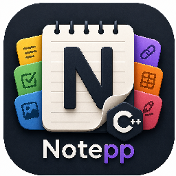


A **C++ desktop note-taking app** powered by Dear ImGui. Notes are stored as plain **Markdown files**, organized in folders, and enriched with an interactive UI block system, drawings, and rich formatting.

---

## Table of Contents

1. [Interface Overview](#1-interface-overview)
2. [Folders & Notes](#2-folders--notes)
3. [Editing & Markdown](#3-editing--markdown)
   - [Emoji Picker](#emoji-picker)
4. [HTML Compatibility](#4-html-compatibility)
5. [Toolbar Reference](#5-toolbar-reference)
6. [Text Color Syntax](#6-text-color-syntax)
7. [Drawing Tools](#7-drawing-tools)
8. [Images & Fonts](#8-images--fonts)
9. [Search](#9-search)
10. [Detached Windows](#10-detached-windows)
11. [Undo / Redo](#11-undo--redo)
12. [Keyboard Shortcuts](#12-keyboard-shortcuts)
13. [UI Block System](#13-ui-block-system)
    - [Variables](#131-variables)
    - [Widgets](#132-widgets)
    - [Expressions & Operators](#133-expressions--operators)
    - [Built-in Functions](#134-built-in-functions)
    - [Conditionals](#135-conditionals)
    - [Label Color Syntax](#136-label-color-syntax)
    - [Global Variables](#137-global-variables)
    - [Full Examples](#138-full-examples)
14. [Reactive Diagrams (ui-mermaid)](#14-reactive-diagrams-ui-mermaid)
15. [Mermaid Diagrams](#15-mermaid-diagrams)
    - [Flowchart / Graph](#151-flowchart--graph)
    - [Pie Chart](#152-pie-chart)
    - [Recognized Types (Placeholder)](#153-recognized-types-placeholder)

---

## 1. Interface Overview

```
┌──────────────────────────────────────────────────────┐
│  Toolbar  (formatting, drawing, layout controls)     │
├──────────────┬───────────────────────────────────────┤
│              │                                       │
│   Sidebar    │         Editor / Preview              │
│              │                                       │
│  • Folders   │   Write markdown on the left,        │
│  • Notes     │   rendered preview on the right.     │
│  • Images    │                                       │
│  • Fonts     │                                       │
│              │                                       │
└──────────────┴───────────────────────────────────────┘
```

- **Sidebar** — left panel: folder tree, note list, image browser, font browser.
- **Editor** — center/right: markdown editor with live preview.
- **Toolbar** — top: all formatting, drawing, and layout buttons.
- **Floating windows** — notes can be detached into independent draggable panels.

---

## 2. Folders & Notes

### Creating

| Action | How |
|--------|-----|
| New folder | Right-click in the sidebar folder area → **New Folder** |
| New note | Right-click a folder → **New Note**, or use the `+` button |
| Rename | Right-click the folder or note → **Rename**, or select and press **F2** |
| Delete | Right-click → **Delete** |

### Organizing

- **Colors** — right-click a note → **Color** to assign a custom RGB color; folders have their own accent color.
- **Copy / Paste notes** — right-click → **Copy**, then right-click destination folder → **Paste**.
- **Hidden notes** — notes can be toggled hidden from the context menu.

### Selecting multiple notes

Hold **Ctrl + Click** to select several notes in the sidebar for batch operations.

---

## 3. Editing & Markdown

Each note is a `.md` file. The editor supports full UTF-8 text including emoji ✅.

### Supported Markdown

| Syntax | Result |
|--------|--------|
| `# Heading 1` … `###### Heading 6` | Collapsible section headers |
| `**bold**` | **bold** |
| `*italic*` | *italic* |
| `~~strike~~` | ~~strikethrough~~ |
| `` `code` `` | inline code |
| ```` ```lang … ``` ```` | syntax-highlighted code block |
| `- item` / `1. item` | bullet / numbered list |
| `- [ ] task` / `- [x] done` | interactive task checkboxes |
| `[text](url)` | clickable link |
| `` | embedded image |
| `> quote` | blockquote |
| `| col | col |` | table |

### Emoji Picker 

Press **Ctrl+.** while editing to insert emoji.

| Platform | Behaviour |
|----------|-----------|
| **Linux** | Opens a built-in floating panel with ~380 emoji |
| **Windows** | Triggers the native OS emoji panel (Win+.) |

**Built-in picker (Linux):**

- **Search bar** — type any keyword (e.g. `fire`, `cat`, `heart`) to filter across all categories.
- **Category tabs** — click a tab icon to browse Smileys, People, Animals, Food, Travel, Objects, Nature, or Symbols.
- Click any emoji to insert it at the cursor and close the picker.
- Press **Ctrl+.** again or click **×** to close without selecting.

---

### Markdown Preview

Click the **Preview** toggle in the toolbar to switch to rendered view. Section headers become collapsible — click them to expand or collapse. All section states are saved between sessions.

---

## 4. HTML Compatibility

Notes support a subset of HTML inline tags alongside standard Markdown. These can be mixed freely with Markdown syntax.

### Supported Tags

| Tag | Example | Result |
|-----|---------|--------|
| `<br>` | `line one<br>line two` | Hard line break |
| `<kbd>` | `<kbd>Ctrl</kbd>+<kbd>Z</kbd>` | Keyboard key chip |
| `<mark>` | `<mark>highlighted text</mark>` | Yellow highlight |
| `<sup>` | `x<sup>2</sup>` | Superscript |
| `<sub>` | `H<sub>2</sub>O` | Subscript |
| `` | `` | Image with custom size |
| `<u>` | `<u>underlined</u>` | Underline |
| `<hr>` | `<hr>` | Horizontal rule |

### `<kbd>` — Keyboard keys

Render keyboard shortcuts with a styled key cap:

```markdown
Press <kbd>Ctrl</kbd>+<kbd>S</kbd> to save.
Use <kbd>Ctrl</kbd>+<kbd>Z</kbd> / <kbd>Ctrl</kbd>+<kbd>Y</kbd> for undo/redo.
```

### `<mark>` — Highlight

Draw attention to important text:

```markdown
Remember: <mark>always commit before merging</mark>.
```

### `<sup>` / `<sub>` — Scripts

Superscript for exponents and footnotes, subscript for formulas:

```markdown
E = mc<sup>2</sup>
H<sub>2</sub>O is water.
Area = πr<sup>2</sup>
```

### `` — Images with custom dimensions

Standard Markdown images auto-scale to the note width. Use `` when you need a specific size:

```markdown


```

Both `width` and `height` are optional. If only one is given, the other scales proportionally. Remote URLs follow the same background-download behaviour as Markdown images.

### Inline image rows

Multiple small images (height ≤ 48 px) on adjacent lines automatically flow inline, making badge rows easy to write:

```markdown


```

A **single newline** between images keeps them on the same row. A **blank line** starts a new paragraph on a separate line.

---

## 5. Toolbar Reference

### Edit mode toolbar

| Icon | Button | Action |
|------|--------|--------|
|  | **Bold** | Wraps selection in `**…**` |
|  | **Italic** | Wraps selection in `*…*` |
|  | **Strikethrough** | Wraps selection in `~~…~~` |
|  | **Note Quote** | Inserts a styled blockquote |
|  | **Color Text** | Opens color picker, wraps selection in `[color=#RRGGBB]…[/color]` |
|  | **Task List** | Inserts `- [ ] ` task item |
|  | **Table** | Opens dialog — choose rows & columns, inserts Markdown table |
| 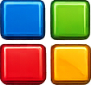 | **UI Block** | Inserts a new `ui` code fence |
|  | **Find** | Opens search panel (Ctrl+F) |

### Drawing / Preview mode toolbar

| Icon | Button | Action |
|------|--------|--------|
|  | **Mouse mode** | Standard cursor, no drawing |
|  | **Draw mode** | Free-hand drawing |
|  | **Erase mode** | Erase drawn strokes |
| 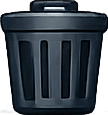 | **Clear drawing** | Removes all strokes in this folder |
|  /  | **Show/Hide drawing** | Toggle drawing layer visibility |
|  /  | **Show/Hide grid** | Toggle alignment grid overlay |

### Layout toolbar

| Icon | Button | Action |
|------|--------|--------|
|  /  | **Lock / Unlock** | Lock note window positions to prevent accidental moves |
|  | **Reset positions** | Resets all floating note windows to default layout |
|  | **Detach windows** | Toggle floating detached note windows on/off |
|  | **Refresh directory** | Rescans the current folder for new files |

---

## 6. Text Color Syntax

Apply color to any text inside a note (editor or UI block labels):

```
[color=#RRGGBB]colored text[/color]
[color=#RRGGBBAA]text with alpha[/color]
```

**Examples:**

```markdown
[color=#FF4444]Red alert![/color]
[color=#00CC88]Success message[/color]
[color=#3399FF80]Translucent blue[/color]
```

The color picker in the toolbar generates this syntax automatically for selected text.

---

## 7. Drawing Tools

Drawings are stored **per folder** (shared across all notes in the folder) and overlaid on the note view.

### Workflow

1. Switch to **Preview** mode (drawings are visible in preview).
2. Click the **Draw**  button.
3. Draw freely with your mouse or stylus.
4. Use **Erase**  to remove strokes.
5. Pick a color from the preset palette or open the custom color picker.

### Controls

| Control | Action |
|---------|--------|
| Draw button + drag | Create a stroke |
| Erase button + drag | Erase strokes under cursor |
| Color preset buttons | Switch stroke color (Red, Orange, Green, Blue, Purple, White) |
| Custom color picker | Pick any RGB color |
| Stroke thickness | Adjustable slider (default 2.2) |
| Ctrl+Z | Undo last stroke |
| Ctrl+Y | Redo stroke |
| Clear drawing | Delete all strokes in the folder |

---

## 8. Images & Fonts

### Images

- **Supported formats:** PNG, JPG, JPEG, GIF, BMP, WebP
- **Embed in markdown:** `` — path relative to the note folder
- **Image browser:** The sidebar lists all images in the current folder
- **Drag & drop:** Drag an image from the sidebar onto the note text to insert it
- **Right-click image in sidebar → Reveal in File Explorer**

### Right-click an image in preview

Right-clicking any rendered image opens a context menu with two actions:

| Action | Description |
|--------|-------------|
| **Copy image text** | Copies the original source line (`` or ``) to the clipboard, ready to paste into another note |
| **Edit size…** | Opens a dialog to set width and height |

**Edit size dialog:**

- **Width / Height** — pixel values for the rendered size.
- **Proportional** checkbox — when checked, height is computed automatically from the aspect ratio and only `width=` is stored. Uncheck to set both dimensions independently.
- Clicking **Apply** replaces the image reference with an `` tag using the chosen dimensions. Markdown syntax (``) is automatically converted to HTML in the process.

### Fonts

- **Supported:** TTF and OTF files
- **Add a font:** Drop a font file into the folder, or use the font browser
- **Apply to a note:** Drag a font from the sidebar onto the note
- **Font size:** Ctrl+Scroll while hovering a note to resize text
- **Per-note:** Each note keeps its own font and size independently

---

## 9. Search

Open with **Ctrl+F** or the  toolbar button.

- Searches **note titles**, **file paths**, and **full note content**
- Results show the matching line with a snippet preview
- Click a result to jump directly to that note
- Search scope spans the entire project

---

## 10. Detached Windows

Click  to enable floating note windows. Each note opens in its own movable panel.

| Feature | How |
|---------|-----|
| Enable/disable | Detach button in toolbar |
| Move windows | Drag the title bar |
| Lock positions |  Lock button — prevents accidental moves |
| Reset layout |  Reset positions button |
| Always on top | Right-click a floating note window title bar |

---

## 11. Undo / Redo

A unified history tracks text edits, note selection, layout changes, preview state, and drawings.

| Shortcut | Action |
|----------|--------|
| Ctrl+Z | Undo |
| Ctrl+Y | Redo |
| Ctrl+Shift+Z | Redo (alternative) |

Undo groups character-level changes into word-granular chunks for convenient reversal.

---

## 12. Keyboard Shortcuts

| Shortcut | Action |
|----------|--------|
| Ctrl+Z | Undo |
| Ctrl+Y / Ctrl+Shift+Z | Redo |
| Ctrl+F | Open Find / Search |
| Ctrl+. | Open emoji picker (Linux) / native emoji panel (Windows) |
| Ctrl+Scroll | Change font size (hover over note) |
| Ctrl+Click | Multi-select notes in sidebar |
| F2 | Rename selected note or folder |
| Double-click word | Select entire word |
| Right-click | Context menus everywhere |

---

## 13. UI Block System

Embed **interactive widgets** directly inside any note using a fenced code block with the `ui` language tag.

````markdown
>```ui
>variableName(initialValue)
>widget(variable, "Label", width, ...options)
>```
````

Widget state is **persistent** — values survive edits, closing, and reopening. Changing the markdown source resets only the blocks that actually changed.

Lines starting with `//` are treated as comments and ignored.

---

### 13.1 Variables

Declare variables on their own line: `name(expression)`

```
count(10)
name("Alice")
active(true)
items(["sword", "shield", "potion"])
```

**Computed variables** reference other variables:

```
count(5)
doubled(count * 2)
label("Total: ")
```

**Types supported:** number (integer or float), string, boolean, array, object.

---

### 13.2 Widgets

Every widget goes on its own line (or multiple widgets on the same line, separated by spaces — they render inline on the same row).

---

#### `text` — Display or edit text

**Display (read-only):**
```
text("static string")
text(variable)
```

**Input field (editable):**
```
text(variable, "Label", width)
text(variable, "Label", width, "Tooltip text")
```

| Arg | Description |
|-----|-------------|
| variable | Variable to display/edit |
| `"Label"` | Label shown next to field (supports `[color=…]`) |
| width | Width in pixels |
| `"Tooltip"` | Optional tooltip on hover |

**Example:**
```
name("World")
text(name, "Name", 160, "Enter your name")
text("Hello, ") text(name) text("!")
```

---

#### `int` — Integer input

```
int(variable, "Label", width)
int(variable, "Label", width, true)
```

The optional 4th argument enables step buttons (+/-).

**Example:**
```
score(0)
int(score, "Score", 100, true)
```

---

#### `slider` — Numeric slider

```
slider(variable, "Label", width, min, max)
```

| Arg | Description |
|-----|-------------|
| variable | Numeric variable |
| `"Label"` | Label |
| width | Width in pixels |
| min | Minimum value |
| max | Maximum value |

**Example:**
```
volume(50)
slider(volume, "Volume", 200, 0, 100)
```

---

#### `checkbox` — Boolean toggle

```
checkbox(variable, "Label")
```

**Example:**
```
enabled(true)
checkbox(enabled, "Enable feature")
```

---

#### `enum` — Dropdown selector

```
enum(variable, "Label", width, ["Option1", "Option2", "Option3"])
```

Stores the **selected string** into the variable.

**Example:**
```
mode("Home")
enum(mode, "Context", 140, ["Home", "Work", "Ideas", "Archive"])
```

---

#### `multicheck` — Multi-select checkboxes

```
multicheck(variable, "Label", width, ["Option1", "Option2", "Option3"])
```

Stores the **selected items as an array**.

**Example:**
```
tags(["important"])
multicheck(tags, "Tags", 200, ["important", "urgent", "later", "daily"])
```

---

#### `list` — Scrollable item list

```
list(variable, "Label", width, selectable)
```

`variable` must be an **array of objects**, each with a `name` field (and optionally a `tooltip` field).

```
items([
  {name:"Sword",   tooltip:"Basic weapon"},
  {name:"Shield",  tooltip:"Blocks attacks"},
  {name:"Potion",  tooltip:"Restores health"}
])
list(items, "Inventory", 220, true)
```

`selectable: true` enables click-to-select and drag-to-reorder.

---

#### `inventory` — Icon grid

```
inventory(variable, "Label", width, rows, cols)
```

`variable` is an **array of slot objects**. Each slot supports:

| Field | Type | Description |
|-------|------|-------------|
| `name` | string | Item title shown on hover |
| `image` | string | Image path (relative, absolute, or filename from `assets/icons/`) |
| `tooltip` | string | Hover tooltip text |
| `quantity` | number | Badge number shown in the slot corner |
| `color` | string `#RRGGBB` | Corner mark color |
| `enabled` | bool | Grayed-out when `false` |

**Example:**
```
backpack([
  {name:"Sword",  image:"sword.png",  tooltip:"Iron sword",  quantity:1},
  {name:"Coin",   image:"coin.png",   tooltip:"Gold coin",   quantity:42, color:"#FFD700"},
  {name:"Potion", image:"potion.png", tooltip:"Health pot",  enabled:false}
])
inventory(backpack, "Backpack", 300, 2, 4)
```

---

#### `button` — Action button

```
button("Label", width, variable=value)
```

Clicking the button **assigns a value to a variable**. Multiple assignments separated by commas are not currently supported — use one assignment per button.

**Example:**
```
count(0)
int(count, "Count", 80, true)
button("Reset", 80, count=0)
button("Max",   80, count=100)
```

---

### 13.3 Expressions & Operators

Expressions are used in variable declarations and `if()` conditions.

| Operator | Description | Example |
|----------|-------------|---------|
| `+` `-` `*` `/` | Arithmetic | `count * 2 + 1` |
| `==` `!=` | Equality | `mode == "Work"` |
| `>` `<` `>=` `<=` | Comparison | `score >= 100` |
| `&&` | Logical AND | `active && score > 0` |
| `\|\|` | Logical OR | `a == 1 \|\| b == 2` |
| `!` | Logical NOT | `!empty(name)` |
| `-value` | Negation | `-count` |
| `array[i]` | Array index (0-based, negative counts from end) | `tags[0]`, `items[-1]` |

**Truthiness rules:**
- Number: `true` if non-zero
- String: `true` if non-empty
- Array/Object: `true` if non-empty
- Bool: as-is

---

### 13.4 Built-in Functions

| Function | Signature | Description |
|----------|-----------|-------------|
| `len` | `len(str\|array)` | Length of a string or array |
| `contains` | `contains(str, substr)` or `contains(array, value)` | Substring check or array membership |
| `starts_with` | `starts_with(str, prefix)` | True if string starts with prefix |
| `ends_with` | `ends_with(str, suffix)` | True if string ends with suffix |
| `empty` | `empty(value)` | True if value is falsy / empty |

**Examples:**
```
if(len(notes) > 0) {
  text("Has notes")
}
if(contains(tags, "urgent")) {
  text("[color=#FF4444]URGENT[/color]")
}
if(starts_with(name, "Dr.")) {
  text("Doctor detected")
}
if(!empty(description) && len(description) <= 200) {
  text(description)
}
```

---

### 13.5 Conditionals

Show or hide any group of widgets based on a condition:

```
if(condition) {
  widget(...)
  widget(...)
}
```

- The `{` must be on the **same line** as `if(...)`.
- The closing `}` must be on its **own line**.
- Conditions use the full expression syntax from [12.3](#123-expressions--operators).
- Conditionals can reference any declared variable.

**Conditional assignments** — assign a value to a variable when a condition is true:

```
lvl(0)
xp(300)
if(xp >= 300) {
  lvl = lvl + 2
}
text(lvl)
```

Compound assignment shorthand: `lvl += 2` equals `lvl = lvl + 2`. Supported: `+=` `-=` `*=` `/=`.

> Assignments inside `if` blocks are **persistent** — every frame the condition is true, the new value is written back to the note. Use this for conditional state transitions, and `button()` for one-shot changes.

**Examples:**
```
level(1)
slider(level, "Level", 160, 1, 10)

if(level >= 5) {
  text("[color=#FFD700]Gold rank unlocked[/color]")
}
if(level >= 10) {
  text("[color=#FF4444]MAX LEVEL[/color]")
}
```

```
mode("off")
enum(mode, "Mode", 120, ["off", "easy", "hard"])

if(mode == "easy") {
  slider(health, "Health", 140, 1, 100)
}
if(mode == "hard") {
  text("[color=#FF0000]No health bar — good luck[/color]")
}
```

---

### 13.6 Label Color Syntax

Widget labels support inline color formatting:

```
text("[color=#00CC88]Status[/color]", 120)
checkbox(done, "[color=#AAAAAA]Done[/color]")
```

Format: `[color=#RRGGBB]text[/color]` or `[color=#RRGGBBAA]text[/color]` for alpha.

---

### 13.7 Global Variables

Place a `.globals.md` file in any folder to declare variables shared across all notes in that folder. Only `ui` blocks inside it are read.

````markdown
```ui
campaign("Curse of Strahd")
party_level(5)
gold(120)
```
````

Any note in the same folder (or a subfolder) can then reference `campaign`, `party_level`, or `gold` directly in its own UI blocks without re-declaring them. Variables declared in the current note override globals with the same name.

**Load order** (closest scope wins):

1. Root-level `.globals.md`
2. Parent folder `.globals.md`
3. Current folder `.globals.md`
4. Current note UI block

`.globals.md` is optional — if the file doesn't exist, nothing changes. Create one via **Insert UI widget example → Global variable**, which creates the file in the current note's folder and opens it for editing.

---

### 13.8 Full Examples

#### Simple counter

````markdown
```ui
count(0)
int(count, "Counter", 90, true)
button("Reset", 80, count=0)
```
````

---

#### Character sheet

````markdown
```ui
name("Hero")
class_("Warrior")
hp(100)
mp(40)
level(1)
alive(true)

text(name,   "Name",  140) text(class_, "Class", 120)
slider(hp,   "HP",    160, 0, 100)
slider(mp,   "MP",    160, 0, 100)
int(level,   "Level",  70, true)
checkbox(alive, "Alive")

if(!alive) {
  text("[color=#FF4444]CHARACTER IS DEAD[/color]")
}
if(level >= 10) {
  text("[color=#FFD700]Max level reached![/color]")
}
```
````

---

#### Task tracker

````markdown
```ui
tasks([
  {name:"Write report",   tooltip:"Due Friday"},
  {name:"Review PR",      tooltip:"Urgent"},
  {name:"Update docs",    tooltip:"Low priority"},
  {name:"Deploy staging", tooltip:"After tests"}
])
filter("all")
enum(filter, "Show", 110, ["all", "done", "pending"])
list(tasks, "Tasks", 260, true)
```
````

---

#### Inventory grid

````markdown
```ui
inventory_data({
  rows:2,
  cols:2,
  items:[
    {name:"Potion", image:"potion.png", tooltip:"Consumable item", quantity:3, color:"#57A7FF"},
    {tooltip:"Disabled example cell", color:"#FFB347", enabled:false}
  ]
})
inventory(inventory_data, "Inventory", 220, 2, 2)
```
````

---

#### Conditional form

````markdown
```ui
role("user")
enum(role, "Role", 130, ["user", "admin", "guest"])

if(role == "admin") {
  text("[color=#FF8800]Admin panel[/color]")
  checkbox(debug_mode, "Debug mode")
  slider(log_level, "Log level", 140, 0, 5)
}
if(role == "guest") {
  text("[color=#888888]Read-only access[/color]")
}
```
````

---

## 14. Reactive Diagrams (ui-mermaid)

A `ui-mermaid` fenced block is a Mermaid diagram template where `${expr}` placeholders are resolved against the current UI variable state before rendering. Any widget, button, slider, or computed value — including variables from `.globals.md` — will update the diagram live as values change.

````markdown
```ui-mermaid
xychart-beta
  title "Monthly Sales"
  x-axis [Jan, Feb, Mar]
  y-axis 0 --> 20000
  bar ${sales}
```
````

When `sales` is `[5000, 8000, 12000]` the placeholder expands to `[5000, 8000, 12000]` and the chart renders with those values. Buttons or sliders that modify `sales` will redraw the chart on the next frame.

### Expression syntax

Any expression the UI block system supports is valid inside `${ }`:

| Placeholder | Expands to |
|-------------|-----------|
| `${gold}` | current value of variable `gold` |
| `${sales[0]}` | first element of array `sales` |
| `${party_level * 10}` | arithmetic on a variable |
| `${sales}` | full array literal `[v1, v2, v3]` |

### Example — buttons that update a chart

**`.globals.md`** (shared across folder):

````markdown
```ui
sales([5000, 8000, 12000])

button("Boost January", 140, sales[0]=15000)
button("Boost March",   140, sales[2]=18000)
```
````

**Any note in the folder:**

````markdown
```ui-mermaid
xychart-beta
  title "Monthly Sales"
  x-axis [Jan, Feb, Mar]
  y-axis 0 --> 20000
  bar ${sales}
```
````

Clicking "Boost January" updates `sales[0]` to `15000` and the chart redraws immediately.

### Rules

- Only `ui` blocks and `.globals.md` variables are in scope — no other markdown state.
- If a `${expr}` fails to evaluate, the placeholder is left as-is in the diagram source.
- All Mermaid diagram types are supported.

---

## 15. Mermaid Diagrams

Embed diagrams in any note with a `mermaid` fenced code block, or use the diagram keyword directly as the fence language. All diagram types listed below are **fully rendered** as interactive graphics inside the note preview. Lines starting with `//` are treated as comments and ignored.

````markdown
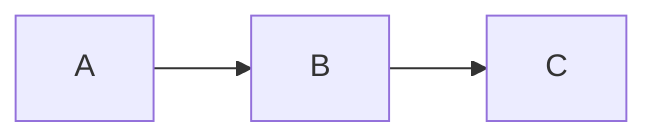
````

---

### 15.1 Flowchart / Graph

**Keywords:** `flowchart`, `graph`

**Directions:** `TB` / `TD` (top-bottom, default) · `BT` · `LR` · `RL`

**Node shapes:** `id[Label]` rectangle · `id(Label)` rounded · `id{Label}` diamond

**Edge types:** `-->` arrow · `<-->` bidirectional · `<--` reverse · `-.->` dotted · `---` line · `==>` thick

**Edge labels:** `A -->|text| B`

````markdown
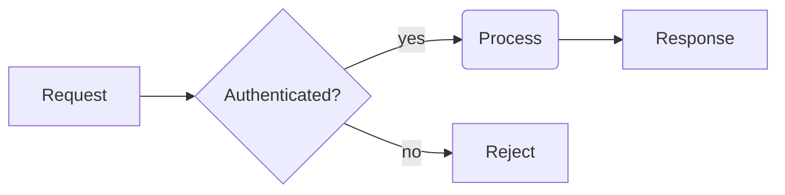
````

````markdown
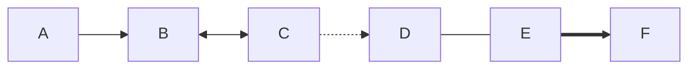
````

---

### 15.2 Pie Chart

**Keyword:** `pie`  · `title` is optional.

````markdown
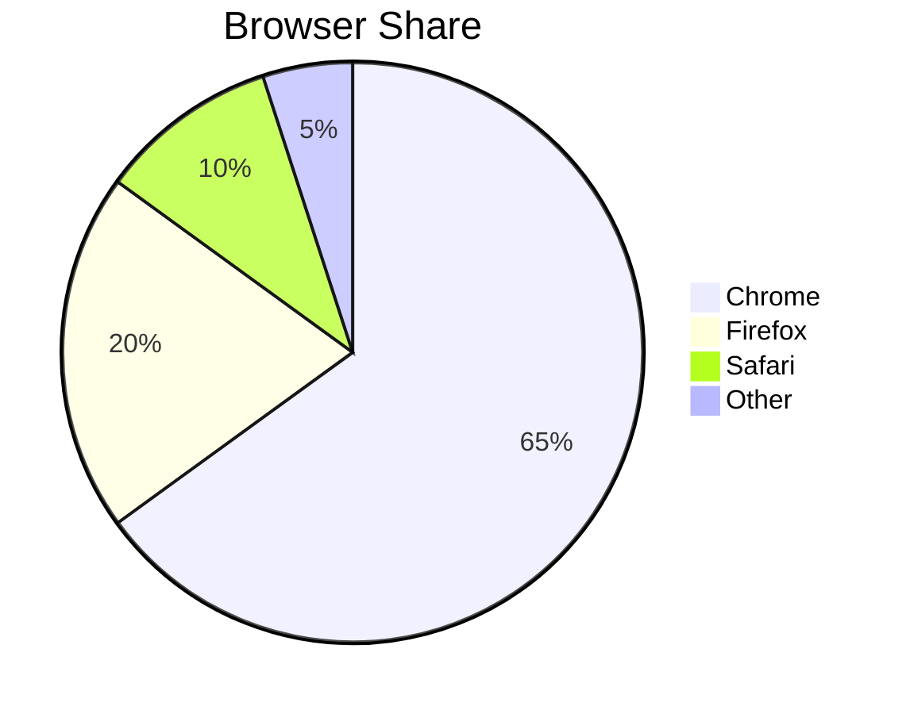
````

---

### 15.3 Sequence Diagram

**Keyword:** `sequenceDiagram`

Supported: `participant`, `actor`, `->>` / `-->` / `-->>` arrows, `Note over`, `activate` / `deactivate`, `loop` / `alt` / `opt` / `par` groups.

````markdown
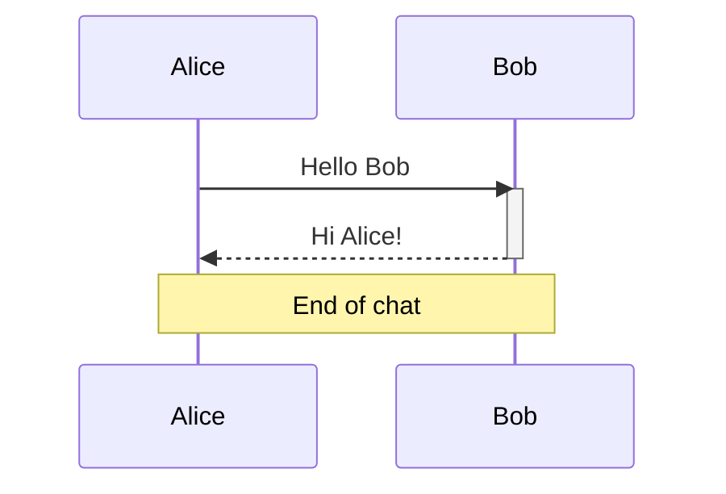
````

---

### 15.4 Class Diagram

**Keyword:** `classDiagram`

````markdown
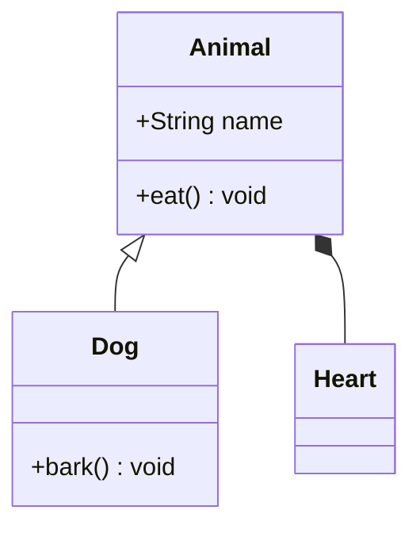
````

---

### 15.5 State Diagram

**Keywords:** `stateDiagram`, `stateDiagram-v2`  · `[*]` = start / end state.

````markdown
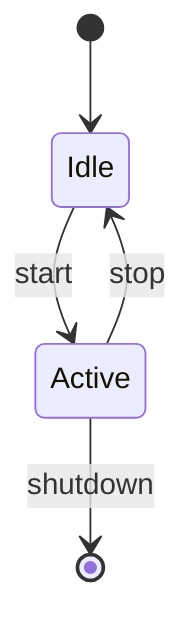
````

---

### 15.6 Entity Relationship Diagram

**Keyword:** `erDiagram`

````markdown
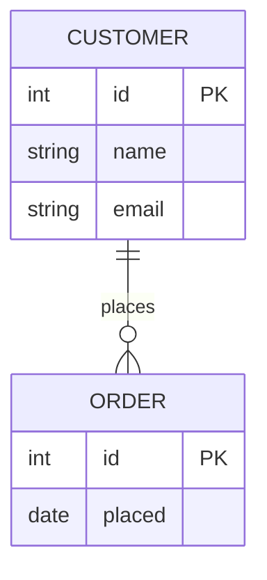
````

---

### 15.7 User Journey

**Keyword:** `journey`

````markdown
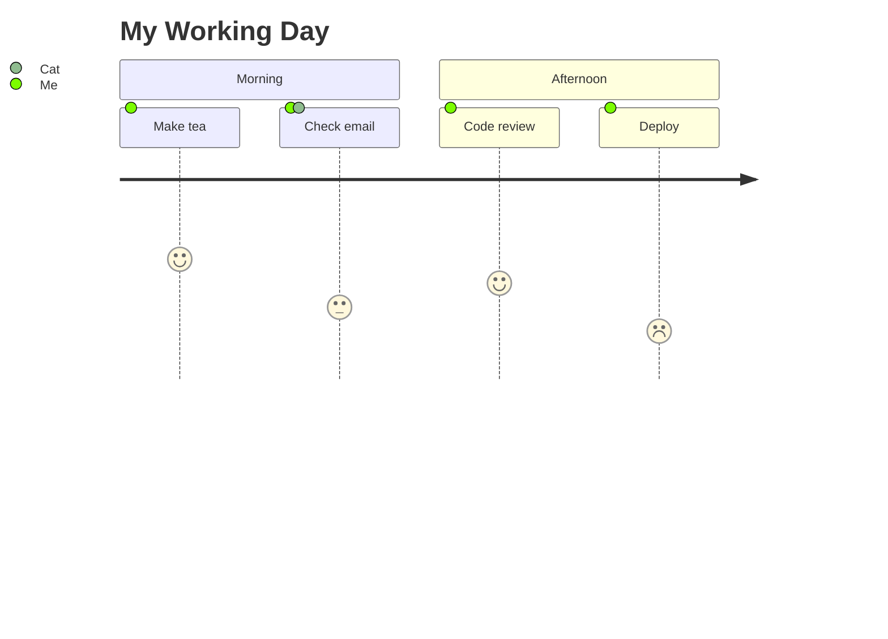
````

---

### 15.8 Gantt Chart

**Keyword:** `gantt`  · Duration units: `d` (days), `w` (weeks), `h` (hours).

````markdown
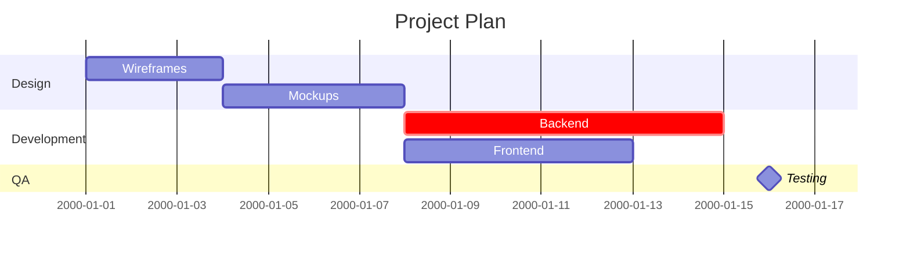
````

---

### 15.9 Quadrant Chart

**Keyword:** `quadrantChart`

````markdown
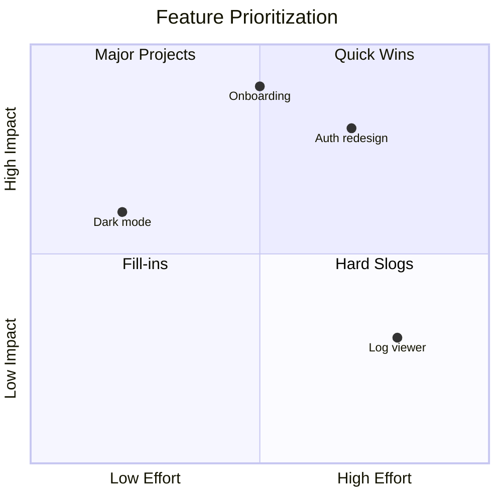
````

---

### 15.10 Requirement Diagram

**Keyword:** `requirementDiagram`

````markdown
```mermaid
requirementDiagram
  requirement auth_req {
    id: REQ-1
    text: Users must authenticate
    risk: high
    verifymethod: test
  }
  element login_page {
    type: UI
    docref: docs/login
  }
  login_page - satisfies -> auth_req
```
````

---

### 15.11 Git Graph

**Keyword:** `gitgraph`

````markdown
```mermaid
gitgraph
  commit id: "Initial"
  branch develop
  commit id: "Feature A"
  commit id: "Feature B"
  checkout main
  merge develop
  commit id: "Release" tag: "v1.0"
```
````

---

### 15.12 Mindmap

**Keyword:** `mindmap`  · Indentation defines hierarchy. Shape wrappers: `((text))` circle · `(text)` rounded · `[text]` square · `{{text}}` hexagon.

````markdown
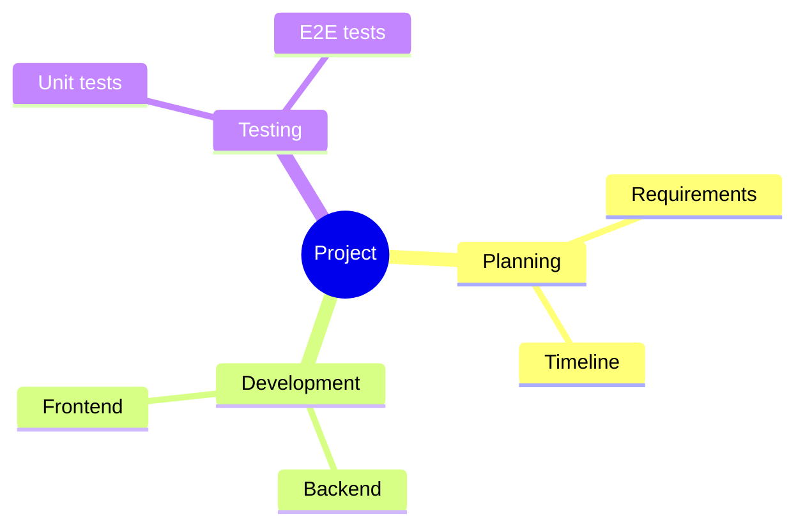
````

---

### 15.13 Timeline

**Keyword:** `timeline`  · Format: `period : event1 : event2`

````markdown
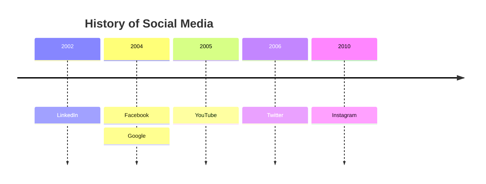
````

---

### 15.14 Sankey Diagram

**Keywords:** `sankey-beta`, `sankey`  · CSV format: `source,target,value`

````markdown
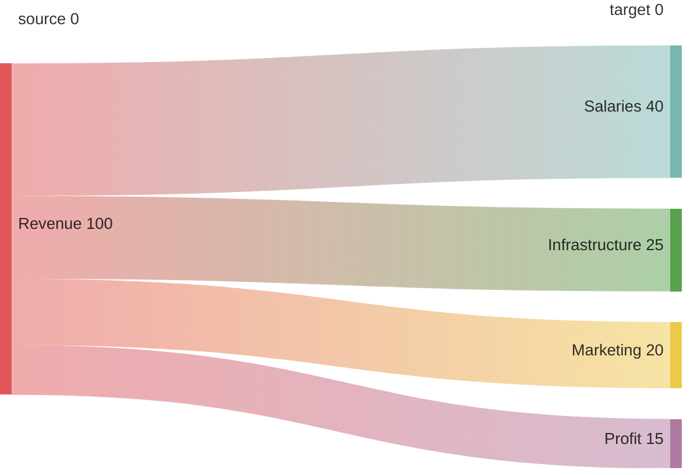
````

---

### 15.15 XY Chart

**Keywords:** `xychart-beta`, `xychart`

````markdown
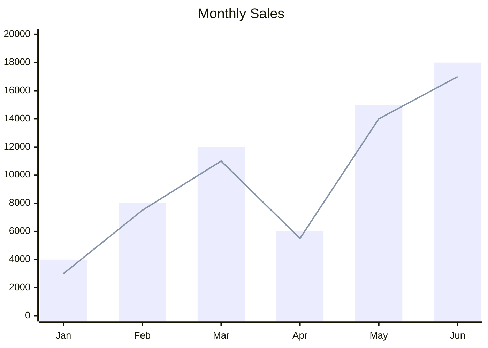
````

---

### 15.16 Block Diagram

**Keywords:** `block-beta`, `block`

````markdown
```mermaid
block-beta
  columns 3
  A[Client]
  B[API Gateway]
  C[Database]
  A --> B
  B --> C
```
````

---

### 15.17 Packet Diagram

**Keywords:** `packet-beta`, `packet`  · Format: `start-end: "Field Name"`

````markdown
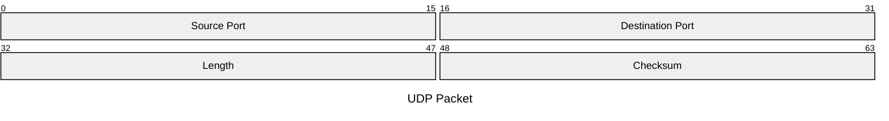
````

---

### 15.18 Kanban Board

**Keyword:** `kanban`  · Columns are top-level items; cards are indented.

````markdown
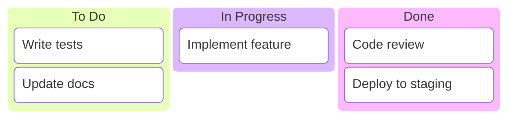
````

---

### 15.19 Architecture Diagram

**Keywords:** `architecture-beta`, `architecture`

````markdown
```mermaid
architecture-beta
  group cloud(server)[Cloud]
    service db(database)[Database] in cloud
    service api(server)[API Server] in cloud
    service cache(server)[Cache] in cloud
  db:L -- R:api
  api:L -- R:cache
```
````

---

### 15.20 Radar Chart

**Keywords:** `radar-beta`, `radar`  · Simple syntax: `Axis: value` per line.

````markdown
```mermaid
radar-beta
  title Developer Skills
  max 100
  Frontend: 75
  Backend: 90
  Database: 70
  DevOps: 60
  Testing: 80
```
````

Multi-curve syntax:

````markdown
```mermaid
radar-beta
  title Team Comparison
  axis ["Speed", "Quality", "Cost", "Scope", "Risk"]
  Alice {
    data [80, 90, 70, 85, 60]
  }
  Bob {
    data [70, 75, 85, 65, 80]
  }
```
````

---

### 15.21 Treemap

**Keywords:** `treemap-beta`, `treemap`  · Indentation = hierarchy; leaf nodes have a numeric value.

````markdown
```mermaid
treemap-beta
  title Team Budget
  Engineering
    Frontend: 30
    Backend: 40
    DevOps: 20
  Marketing: 35
  Operations: 25
```
````

---

### 15.22 ZenUML

**Keyword:** `zenuml`  · Uses `Object.method(Target)` call syntax.

````markdown
```mermaid
zenuml
  @Client
  @Server
  @DB
  Client.request(Server)
  Server.query(DB)
  DB.result(Server)
  Server.response(Client)
```
````

---

### 15.23 Event Modeling

**Keyword:** `eventmodeling`

````markdown
```mermaid
eventmodeling
  title Order System
  command "Place Order"
  event "Order Placed"
  readmodel "Order List"
  policy "Notify on Order"
  processor "Fulfillment"
```
````

---

### 15.24 Venn Diagram

**Keyword:** `venn`

````markdown
```mermaid
venn
  title Programming Skills
  A "Python"
  B "JavaScript"
  C "Rust"
  A&B "Full-Stack"
  A&C "Systems+Script"
  A&B&C "Polyglot"
```
````

---

### 15.25 Ishikawa (Fishbone) Diagram

**Keyword:** `ishikawa`

````markdown
```mermaid
ishikawa
  effect "Bug in Production"
  category "Code"
    cause Untested edge case
    cause Missing validation
  category "Process"
    cause No code review
    cause Rushed release
  category "Environment"
    cause Config mismatch
```
````

---

### 15.26 Wardley Map

**Keyword:** `wardley`  · Components placed at `[visibility, evolution]` (both 0–1).

````markdown
```mermaid
wardley
  title Tea Shop
  component "Cup of Tea" [0.95, 0.50]
  component "Tea Leaves" [0.80, 0.60]
  component "Water"      [0.95, 0.90]
  component "Kettle"     [0.70, 0.75]
  "Cup of Tea" -> "Tea Leaves"
  "Cup of Tea" -> "Water"
  "Water" -> "Kettle"
```
````

---

### 15.27 TreeView

**Keyword:** `treeview`  · Pure indentation hierarchy.

````markdown
```mermaid
treeview
  src
    components
      Button
      Modal
    pages
      Home
      Settings
  tests
    unit
    e2e
```
````

---

## Data Files

Notes are stored in plain text — easy to version-control or edit externally.

| File | Contents |
|------|----------|
| `data/notes/<Folder>/<Note>.md` | Note content (Markdown) |
| `data/notes_index.json` | Folder/note metadata, colors, layout |
| `data/drawings_state.txt` | Drawing strokes per folder |
| `data/imgui_layout.ini` | Window positions and UI state |
| `data/markdown_preview_state.json` | Collapsed/expanded section states |
| `data/note_clipboard.json` | Internal copy/paste clipboard |

---

*Built with C++20 · Dear ImGui · SDL2 · OpenGL*

*Created by*  
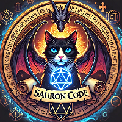

---
